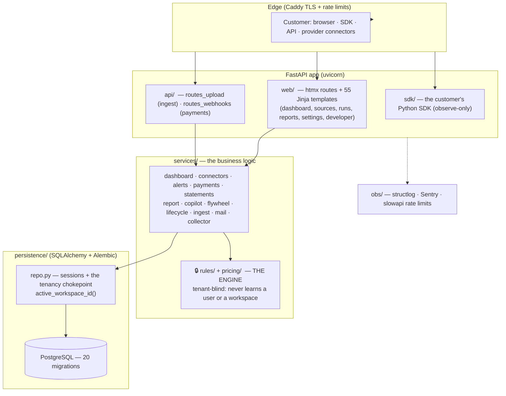

# PLATFORM.md — the whole system, on one page (your ownership map)

You OWN this system: it is your code (every commit authored by you, enforced by a
CI gate — LE-1), in your repo, and this file is the single map that lets you hold
the whole thing in your head. Clarity was never missing — it was *scattered*
across 25+ docs. This is the index and the mental model; the deep docs are linked
where you want to go deeper.

**Scale (2026-07-24):** ~18k lines of source · ~18.5k lines of tests (a near-1:1
test ratio — the system is pinned by tests, not vibes) · 20 DB migrations · 55
HTML templates · 14 architecture docs.

---

## 1. What the platform IS

A **TokenOps cost auditor**: customers connect their LLM usage (upload a log,
install the SDK, or connect a provider like OpenAI/Anthropic/Azure/Bedrock/Vertex),
and the platform audits it for waste — six detectors (oversized model, missing
cache, prompt bloat, retry storms, unbounded max_tokens, chatty loops) — and
returns a dollar-ranked report with fixes. It never sits in the customer's request
path (no proxy, no enforcement — X-01/X-02); it OBSERVES and advises.

---

## 2. Architecture — the layers and the one hard boundary



**The one boundary that must never break:** `services/rules` and
`services/pricing` are the AUDIT ENGINE, and they are **tenant-blind** — they run
on rows and never learn what a user or a workspace is. All identity, tenancy, auth
and money-collection live at the web/persistence boundary. A CI import-guard test
(T-NFR-01) fails the build if the engine ever imports a network/LLM library or
learns about workspaces. This is what keeps the core auditable and portable.

---

## 3. Module map (one line each — where things live)

| Package | What it owns |
|---|---|
| `web/` | Every signed-in surface: `routes_dashboard/sources/runs/explorer/statements/settings/developer/alerts/devices/admin` + 55 htmx templates. Tenancy applied HERE. |
| `api/` | `routes_upload` (the `/api/v1/ingest` + upload contract), `routes_webhooks` (payment providers). |
| `sdk/` | The customer's Python SDK — one call, counts-only by construction, observe-only (never in their request path). |
| `services/rules/` | 🔒 the six waste detectors (the engine). Tenant-blind. |
| `services/pricing/` | 🔒 the rate table + coster (money math). Tenant-blind; rates machine-verified (R-AUTO-PRICING). |
| `services/connectors/` | Provider pulls (OpenAI/Anthropic/Azure/Bedrock/Vertex), the scheduler, the daily digest. |
| `services/dashboard/` | The owner-lens widgets: metrics, savings, explorer, activity. |
| `services/payments/` | Plans, subscriptions, dunning, currency — the billing relationship. |
| `services/alerts/` · `statements/` · `report/` · `copilot/` · `flywheel/` · `lifecycle/` · `ingest/` · `mail/` · `collector/` | Alerts eval/dispatch · monthly savings statements · report render (JSON+PDF) · Copilot seat governance · peer benchmarks · purge/auditlog · ingest normalization · email · the device collector. |
| `persistence/` | `models.py` (the schema), `repo.py` (sessions + `active_workspace_id` — the tenancy chokepoint), `migrations/` (20, Alembic). |
| `obs/` | `logging` (structlog), `errors` (Sentry, FR-22-scrubbed), `ratelimit` (slowapi). |

---

## 4. The data & tenancy model (how isolation works)

- A **Workspace** owns resources; a **WorkspaceMember** joins a user to it with a
  role. Every user is a workspace-of-one by default (single-tenant); orgs are opt-in.
- **One chokepoint**: `repo.active_workspace_id(session, user_id)` returns the
  workspace the caller is acting in — validated against live membership, never
  returns a workspace they don't belong to, never `None` for a real user (which
  would leak). EVERY read of owned data scopes through it. That single function is
  where tenant isolation lives — understand it and you understand the tenancy.
- **The engine never sees any of this** (§2 boundary).

Deep dives: `PLAN-ORG.md` (workspaces/members/RBAC/SSO roadmap), `docs/03-LLD.md`.

---

## 5. Working methods — how change happens (Loop Engineering)

Every change is a **vertical slice** (backend + UI + click-path + journey test +
honest states — shipped end-to-end or not at all) and flows through the loop:

```
Issue → slice → branch off main → implement → CI + gate round → PR → merge → deploy → verify → loop
```

- **The laws** every change obeys (machine-checked): clean authorship · X-scope
  (no proxy/enforcement/RBAC-leak) · FR-22 (no prompt/completion text stored ever)
  · the money law (`pricing_verify.py` — a wrong rate fails the build) · traceability
  · reachability (shipped ≠ exists until a customer can click to it).
- **The gates** (your automated reviewers, run at milestones/PRs): `cold-reviewer`
  (bugs the tests miss), `spec-guard` (scope/requirements), `vv-engineer` (tests +
  money), `system-tester` (walks the whole product), `ux-reviewer` (surfaces),
  `architect`, `ops-engineer`.
- **CI** (`.github/workflows/ci.yml`): authorship · ruff · mypy · pytest+coverage ·
  pricing-verify · docs-drift. **Deploy** (`deploy.yml`): backup → provision →
  smoke → auto-rollback.

Deep dives: `PLAN-LOOP-ENGINEERING.md` (the autonomous loop), `CLAUDE.md` (the laws
verbatim), `docs/10-AGENT-HARNESS.md` (the gate/token discipline).

---

## 6. The toolchain (your tools, and what each is for)

| Tool | Role |
|---|---|
| **uv** | The pinned Python toolchain — ALL checks run `uv run …` (never system python). |
| **FastAPI + uvicorn** | The web/API server. |
| **htmx + Jinja2** | The UI — server-rendered, no SPA (X-05). 55 templates. |
| **SQLAlchemy + Alembic** | ORM + migrations (additive-only in v1). |
| **PostgreSQL** | The database (SQLite for unit tests). |
| **cryptography (Fernet)** | Encrypts connector credentials at rest. |
| **weasyprint** | Report PDF rendering. |
| **structlog · Sentry · slowapi** | Logs · error tracking (FR-22-scrubbed) · rate limits. |
| **pytest · hypothesis · pytest-cov** | Tests + property tests + coverage gate. |
| **ruff · mypy** | Lint/format + strict typing. |
| **Caddy · Docker Compose** | TLS/edge + prod topology. |
| **mkdocs-material** | The public docs site. |
| **GitHub Actions** | CI + continuous deploy. |

---

## 7. The docs map (so 25 docs stop being a maze)

- **Own the product**: `docs/00-PRD.md` (what/why), `docs/01-REQUIREMENTS.md` (FRs/NFRs + the X-scope freeze), `docs/07-ROADMAP.md`.
- **Own the architecture**: `docs/02-HLD.md` (components), `docs/03-LLD.md` (modules), `docs/11-PLATFORM-ARCHITECTURE.md`, `docs/04-TRACEABILITY.md` (req → code → test).
- **Own the methods**: `CLAUDE.md` (the laws), `PLAN-LOOP-ENGINEERING.md` (the loop), `docs/05-TEST-PLAN.md`, `docs/06-OPS-RUNBOOK.md` (deploy/ops), `docs/10-AGENT-HARNESS.md`.
- **Learn the code**: `CODE-TOUR.md` (the teaching syllabus), `DEBUGGING-PLAYBOOK.md`.
- **Current state / queue**: `STATUS.md` (shared memory — what happened, newest first), `KANBAN.md`, `BACKLOG.md`.
- **Per-workstream plans**: `PLAN-ORG` (tenancy), `PLAN-SDK`, `PLAN-V15`, `PLAN-FLYWHEEL`, `PLAN-COPILOT`, `PLAN-TAAS`.

---

## 8. Ownership & cognitive-debt — the practice (this is the strategic part)

**Cognitive debt** = code that exists in the repo but not in your head. It is the
real risk of AI-built systems and of "vibecoding." We eliminate it not by writing
less software, but by making every piece **comprehensible and owned**:

1. **It is literally yours.** Every commit is authored by you, enforced by a CI
   gate (LE-1) — no AI attribution anywhere, ever.
2. **Tests are the ground truth, not vibes.** ~1:1 test:code. A change that isn't
   understood well enough to test doesn't merge.
3. **Every change states its intent in-code.** The sweep this week added a comment
   at every scoping decision so a reviewer reads *why*, not just *what*.
4. **Docs are truth, kept current in the same commit** (traceability rule 5,
   STATUS every milestone). This map is part of that discipline.
5. **The engine boundary keeps the core small** (§2) — the part that must be
   understood deeply is a few thousand lines, tenant-blind and pure.
6. **Teaching is a first-class ritual** (WP-COMPREHEND): open a session with
   `TEACH: <module>` and I walk it line-by-line, define every term, and quiz you.
   Syllabus: `CODE-TOUR.md` → `services/runner.py` → `rules/` → `pricing/`.
7. **Vibecoding → owned engineering** is a MOVE, not a ban: AI does the *execution*
   inside an architecture and a set of laws YOU control; the vertical-slice
   discipline, the gates, and this map are what convert "it works, don't ask how"
   into "you can reason about, test, and change any part."
8. **You are always in control**: the loop has a kill-switch, you can inspect/pause
   any time, and — the honest correction from today — the autonomous loop is
   engineered to keep you in COMPREHENSION (docs, teaching, this map), not just in
   nominal ownership. Speed without comprehension is debt; we don't take that trade.

> The one dial to decide (yours): how much the loop runs hands-off vs. pauses for a
> comprehension checkpoint on load-bearing changes (migrations, the engine, money,
> tenancy). Recommendation: fully autonomous for routine slices; a comprehension
> checkpoint (a teach-back or a review) on the load-bearing few. That keeps velocity
> AND keeps the system in your head.
