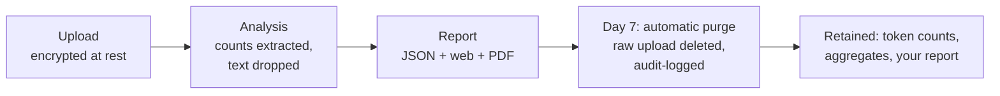

# Data handling

Your logs may contain prompts. Our design assumes they always do, and handles
them accordingly: the policy, verbatim from our landing page — uploaded logs are
"analyzed then deleted; nothing retained beyond 7 days; never used for training."
<!-- src: FR-23 verbatim -->

## Lifecycle

The purge is a daily scheduled job, not a manual promise: seven days after
report generation the raw upload directory is deleted, the deletion is written
to an append-only audit log, and audits that failed before producing a report
are purged on the same clock from their upload time — the 7-day ceiling holds
on failure paths too. <!-- src: FR-21; lifecycle/purge.py; T-LIF-01..03 -->

## What is never persisted

No prompt or completion text is ever written to the database. The ingest layer
extracts token counts and metadata and drops text fields at parse time; where
prefix identity matters (cache and duplicate detection), it is computed as a
SHA-256 hash over the first 4,096 prompt characters, in memory, during
analysis — the hash is stored, the text is not. Evidence rows in findings
carry timestamps, models, and token counts only, capped at 20 per finding.
<!-- src: FR-22; T-LIF-04 counts-only test -->

This is enforced by automated tests, not by convention: a test asserts the
derived aggregates contain counts only, and the exporter we ship for Claude
Code sessions never writes text in the first place.

## Audit log

Every privileged action — purge (scheduled or manual), admin operations,
payment grants, logins — is appended to an audit log that has no update or
delete code path. The database role loses UPDATE/DELETE grants on that table
at deploy. <!-- src: FR-20/21; auditlog.py append-only -->

## Where it runs

Analysis runs on our own single-tenant server. The engine makes no network
calls and imports no LLM SDK — enforced by an automated import-guard test —
so your logs are read by deterministic rules, never by a model, never by a
third party. <!-- src: NFR-01; T-NFR-01 -->
