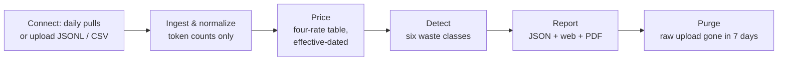

# How it works

One pipeline, five stages, zero AI. Usage comes in — pulled daily from your
connected account, or from a file you upload — and a priced, evidence-backed
findings report comes out. Every stage is deterministic: the same data
produces the same report, byte for byte.
<!-- src: docs/02-HLD.md §3 pipeline; R-CONNECT; NFR-01; T-REP-03 -->

## Stage by stage

**Ingest and normalize.** The parser detects your format per file (OpenAI
JSONL, Anthropic JSONL, or the generic CSV contract) and normalizes every call
into one record: timestamp (UTC), provider, model, and the four token counts.
Text fields are dropped at the door — they never reach the database
(see [Data handling](data-handling.md)). Invalid rows are counted and reported,
not silently patched. <!-- src: FR-01/02; services/ingest -->

**Price.** Each call is priced at the provider rate in effect at its
timestamp, using a versioned four-rate table (input, output,
cache write, cache read). Models without a verified rate card are listed as
unpriced and excluded from totals rather than guessed
(see [Pricing data](pricing-data.md)). <!-- src: FR-05; R-Q4 four rates -->

**Detect.** Six independent detectors walk the priced call frame, each looking
for one waste class. Every finding carries an estimated monthly dollar impact,
a severity, a confidence label, and up to 20 evidence rows — token counts and
timestamps, never text. Estimates are conservative by construction; each
detector's exact formula and haircuts are documented on
[its own page](waste-classes/index.md). <!-- src: FR-07..FR-12; docs/03 §3 -->

**Classify (the shape lens).** Alongside the detectors, each route's workload
is classified into one of five deterministic shapes — agent loop, retry burst,
context growth, unclaimed cache, or steady — from counts, timing and cache
fields only, never content. The shape appears as a chip per route on the
Breakdown page and rides the read API verbatim; its rationale names the exact
counts that crossed a threshold, so there is nothing to second-guess. Audits
from connected usage APIs are never classified — aggregate buckets have no
per-request rows, and the lens says so instead of guessing.
<!-- src: FR-36; services/dashboard/shapes.py; docs/12 INTENT LAW -->

**Report.** All numbers are assembled once into a single report model, then
rendered three ways from that one source: deterministic JSON, the private web
report, and the PDF. The renderers never recompute anything — what you read in
the PDF is what the engine computed, verbatim.
<!-- src: docs/03 ADR-4; T-REP-01 single-assembly -->

**Purge.** Seven days after your report is generated, the raw upload is
automatically deleted and the deletion is written to an append-only audit log.
<!-- src: FR-21 -->

## Why determinism is the feature

The analysis engine imports no LLM and makes no network calls — this is
enforced by an automated import-guard test, not a code-review convention. A
deterministic engine cannot hallucinate a savings number, cannot leak your
logs to a model provider, and produces reproducible reports you can hand to
finance. <!-- src: NFR-01; T-NFR-01 -->
