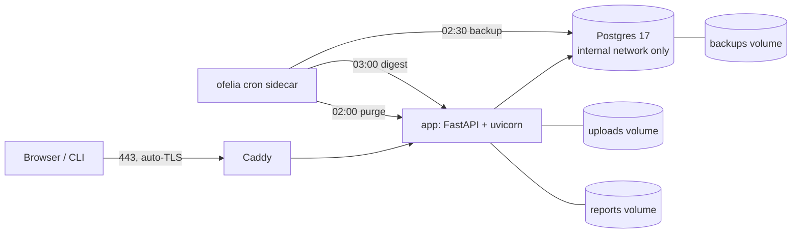
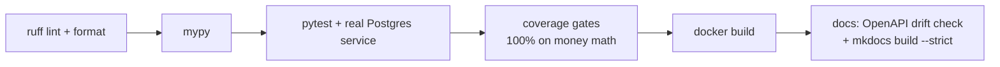

# Integration

## Deploy topology

One VPS, one compose file. TLS terminates at Caddy; the app talks to a
compose-internal Postgres (no published port); a cron sidecar (ofelia) runs
the scheduled jobs inside the existing containers. <!-- src: runbook §1 -->

<!-- src: docker-compose.yml; ofelia.ini -->

Environments: dev (local, SQLite for unit tests), staging (same compose,
`APP_ENV=staging`), production. Deploy target is under 30 minutes from a
clean VPS, documented as a step-by-step runbook; rollback is a git checkout of
the previous tag — migrations are additive-only, so no down-migration risk.
<!-- src: NFR-09; runbook §2 -->

## Scheduled operations

| Job | When (UTC) | What |
|---|---|---|
| purge | 02:00 daily | delete raw uploads older than 7 days post-report; audit-logged |
| backup | 02:30 daily | `pg_dump -Fc` + reports snapshot, 14-day rotation, optional offsite |
| digest | 03:00 daily | ops email: audits, failures, revenue, purge count, and alerts (backup age, disk, pricing-table staleness, pricing-refresh failures) |

The restore path is drilled, not assumed — backup → restore to a fresh
Postgres → fresh smoke audit against the restored database, with times and row
counts logged in the runbook. <!-- src: NFR-08; runbook §4 restore log -->

## CI pipeline

Perf tests are nightly-only (they don't gate every commit); the pricing-table
age check warns loudly past 14 days but never fails the build — staleness is
an ops signal, not a code defect. <!-- src: ci.yml; NFR-15 -->
