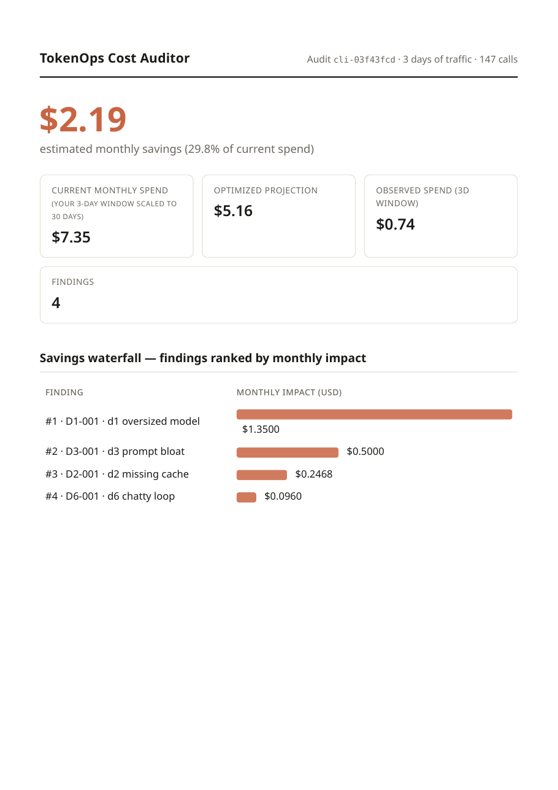

# TokenOps Cost Auditor

TokenOps Cost Auditor turns your AI spend into a dollar-ranked waste audit —
and then keeps watching. Connect your OpenAI or Anthropic account with one
read-only key: the platform pulls your usage daily, audits it weekly with a
deterministic rules engine (no AI reads your data), emails a daily spend
digest, alerts you between audits, and mails your verified Savings Statement
monthly. Prefer not to connect? Upload a log export and get the same audit
on that file. No SDK, no proxy, nothing in your request path.
<!-- src: R-CONNECT; R-FREE-CONNECT; R-DAILY-LOOP; FR-01..FR-16 -->

## The problem, in your terms

You run engineering. Your OpenAI or Anthropic invoice grew faster than usage
did, and nobody on the team can say which line items are waste versus load.
79% of enterprises overran their AI budgets last year (DoiT/Sapio Research,
2026, survey of 500 finance leaders at 1,000+-employee US/UK organizations) —
and even mature FinOps teams in that survey overspent by 31% on average. 98% of
FinOps teams now manage AI spend (State of FinOps, 2026), but the tooling they
use needs SDK or proxy integration before it shows you anything.
<!-- src: docs/09b-MARKET-RESEARCH-REFRESH.md §3 — attributed figures only -->

Agent fleets make this worse. Coding agents and automation pipelines re-send
the same context hundreds of times, retry silently, and never clean up their
prompts. Routers pick a model; we find the other five kinds of waste — and
prove it in dollars. <!-- src: R-ICP ruling; landing differentiation line verbatim -->

## What you get

- A savings waterfall: every finding ranked by estimated monthly dollar impact.
- A daily spend digest — yesterday per source, month-to-date, and your
  budget line — plus alerts that watch between audits (paid plans).
- Six waste classes checked: [oversized models](concepts/waste-classes/oversized-model.md),
  [missing prompt caching](concepts/waste-classes/missing-cache.md),
  [prompt bloat](concepts/waste-classes/prompt-bloat.md),
  [retry storms](concepts/waste-classes/retry-storms.md),
  [unbounded max_tokens](concepts/waste-classes/unbounded-max-tokens.md), and
  [chatty agent loops](concepts/waste-classes/chatty-loops.md).
- Evidence rows for every finding — token counts and timestamps, never your text.
- Methodology and pricing provenance printed inside the report itself.

The sample above is our engineered test fixture — the same synthetic traffic
our golden tests pin to hand-derived dollar figures — not customer data.
<!-- src: MP-2 resolved: waste_pack fixture report, page 1, rendered by the shipping engine -->

## What we never do

Your data policy, verbatim from our landing page and privacy policy: uploaded
logs are
"analyzed then deleted; nothing retained beyond 7 days; your logs and prompts are never used to train any model."
<!-- src: FR-23 verbatim -->

In plain terms:

- Raw uploads are automatically purged 7 days after your report is generated,
  and every purge is written to an append-only audit log. <!-- src: FR-21 -->
- No prompt or completion text is ever written to our database. The engine
  stores token counts, aggregates, and hashes only — enforced by automated
  tests, not just policy. <!-- src: FR-22; T-LIF-04 -->
- No AI reads your logs. The analysis engine contains zero LLM calls, so it
  cannot hallucinate a number. <!-- src: NFR-01; T-NFR-01 import guard -->

## Where to start

- [Quickstart](quickstart.md) — export, upload, read your report.
- [How it works](concepts/how-it-works.md) — the pipeline end to end.
