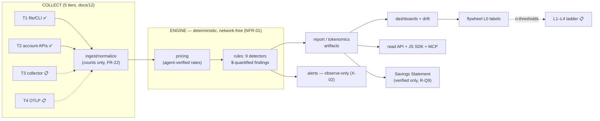

# TokenOps documentation — start here

Two documentation worlds, one rule: **public teaches the product; internal teaches the
platform.** Nothing is duplicated between them — each fact has one home.

| World | Lives in | Audience | Rendered |
|---|---|---|---|
| **Public** | `docs-site/` | customers + external developers | the docs site (mkdocs; `endpoints.md` is generated — never hand-edit, run `scripts/export_openapi.py`) |
| **Internal** | `docs/` + `docs/internal/` | platform developers + the loop's agents | read in-repo |

## Internal reading order (new platform dev, ~half a day)

1. **`00-PRD.md`** — §1 the validated problem statement, personas, value prop, scope.
2. **`01-REQUIREMENTS.md`** — every FR/NFR + the X-scope freeze (what we will NOT build and why).
3. **`02-HLD.md`** — architecture overview, component→requirement map, the audit happy-path
   data flow, ADR summary (tech-stack decisions live here; the public mirror is
   `docs-site/engineering/stack.md`).
4. **`internal/CODE-TOUR.md`** — the same architecture, but walked through real files in
   plain language, 16 stops: the audit pipeline (Part 1) then the platform-era systems
   around it — orgs, the developer platform, flywheel, statements (Part 2).
5. **`12-FLYWHEEL.md`** — the intelligence lifecycle: five ingestion tiers, the
   deterministic engine, the L0–L4 learning ladder with its honesty thresholds, intent law.
6. **`internal/LIFECYCLE-MAP.md`** — one table: every lifecycle capability, its status,
   authority, and trigger. The completeness view.
7. **`03-LLD.md`**, **`05-TEST-PLAN.md`**, **`06-OPS-RUNBOOK.md`** — reference as needed.

## The overview in one diagram

## Where truth lives (never guess, look here)

| Question | File |
|---|---|
| What do we build next? | `internal/QUEUE.md` (the ONLY work spine) |
| Is X shipped, and where's its test? | `04-TRACEABILITY.md` |
| Is the lifecycle complete? What's gated on what? | `internal/LIFECYCLE-MAP.md` |
| What was decided and why? | `STATUS.md` (append-only decision log) |
| How does a slice ship (DoD, gates)? | `09-SDLC.md` |
| Why is my bug happening? | `internal/DEBUGGING-PLAYBOOK.md` |

## Known-stale register

- `uml/` — 2 diagrams, both pre-platform-track → QUEUE candidate T-D2 (architect-gated).
